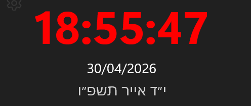

# WinClock Widget

A beautiful, highly configurable, and localized WinUI 3 digital clock widget for Windows.



## Features

- **Customizable Display**: Change fonts, sizes, and colors for both time and date.
- **Advanced Alarms**: Centered alert screen with dimming effect, custom labels, and persistent styling.
- **Global Localization**: Support for 22+ languages (English, Hebrew, Arabic, Chinese, Spanish, French, etc.) managed via organized JSON files.
- **Rich Aesthetics**: Mica backdrop, custom background images, and smooth animations.
- **Responsive Design**: Resize the widget to fit your desktop perfectly.

## Installation

To ensure you can install and run the widget, follow these steps:

### 1. Enable Developer Mode
For Windows 10/11:
1. Open **Settings**.
2. Go to **Privacy & security** > **For developers** (or Update & Security > For developers).
3. Toggle **Developer Mode** to **On**.

### 2. Install App Installer (if missing)
Open PowerShell as Administrator and run:
```powershell
winget install Microsoft.AppInstaller
winget source reset --force
```
## License & Pricing

This software is **not free for commercial or production use**.

- **Free for Learning**: Non-commercial educational use is permitted at no cost.
- **Commercial Use**: Requires a paid license of **1 USDT per user / per year**.
- **AI/LLM Usage**: Any integration or deployment of AI/prompt-based capabilities requires separate paid authorization.

### Payment Instructions
- **Method**: USDT (Tether)
- **Network**: TRON (TRC20) **ONLY**
- **Wallet Address**: `TECYZCJ1xkS4eVreNTfFttAEfVBZwDxqm3`

*Warning: Do NOT send funds via ERC20 or BEP20. Funds will be permanently lost.*

For more details, see the [LICENSE](LICENSE) file.

Copyright © 2026 cpo7-corp. All rights reserved.
